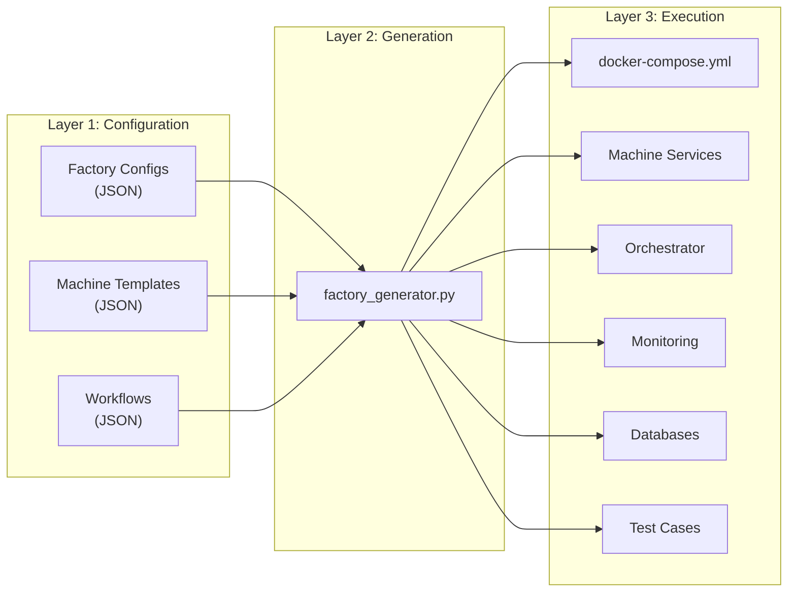
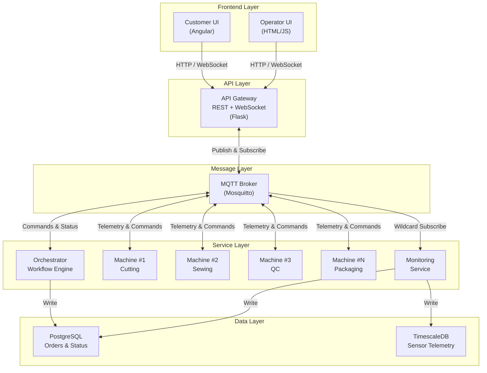
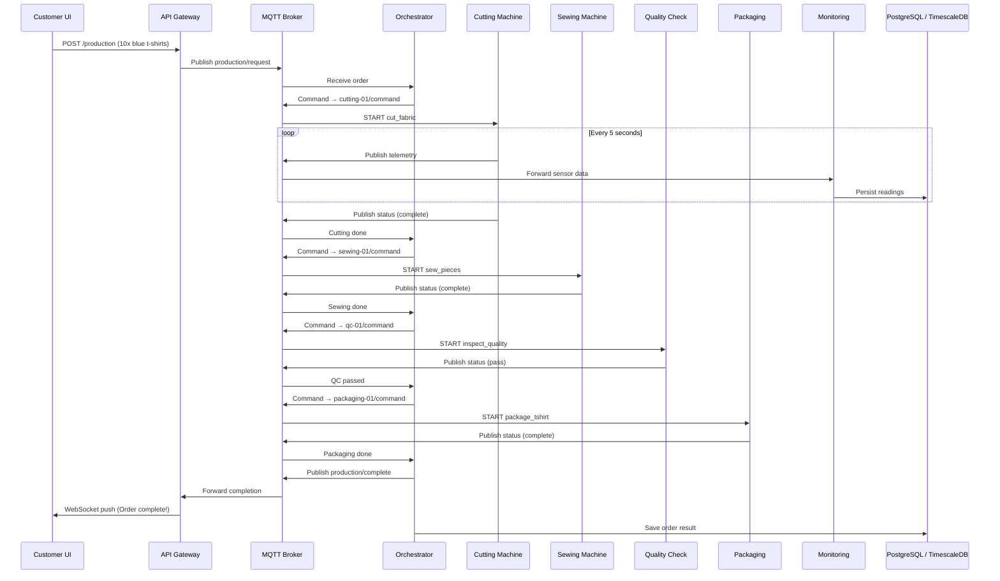

# Why Every IoT Team Needs a Simulation Layer — And How to Build One That Scales

> From smart factories to connected vehicles, simulation is the silent accelerator behind every successful IoT deployment. Here's how we built a universal, JSON-driven platform that generates complete factory simulations — no code required.

---

## The Hidden Cost of Building IoT Without Simulation

If you've ever worked on an IoT project, you know the pain. You design a sensor architecture on a whiteboard, write firmware, build a cloud pipeline, wire up a dashboard — and then you wait. You wait for hardware to arrive. You wait for the factory floor to be available for testing. You wait for edge cases to surface in production, often at the worst possible moment.

This wait isn't just frustrating. It's expensive. McKinsey estimates that **70% of IoT projects stall before reaching scale**, and a significant portion of those failures trace back to one root cause: the system was never tested under realistic conditions before deployment.

Simulation solves this. Not as an afterthought, but as a **first-class development tool** — one that should exist before a single sensor is connected.

This article explores why simulation matters across IoT domains, what makes it difficult to do well, and how we built an open-source platform that generates complete, containerized factory simulations from nothing more than JSON configuration files.

---

## Why Simulation Matters More Than You Think

### In Manufacturing and Industry 4.0

Modern factories are networks of interconnected machines, each producing streams of telemetry data — temperatures, pressures, speeds, vibrations. Before deploying a new production line or modifying an existing workflow, manufacturers need to answer critical questions: *Will the new cutting machine integrate with the existing orchestration system? What happens when the sewing machine's thread tension exceeds its safe operating range? How does the system behave when three machines fail simultaneously?*

Testing these scenarios on a real factory floor means halting production, risking equipment damage, and spending weeks coordinating across teams. A simulation environment lets engineers answer these questions in minutes, on their laptops, without touching a single piece of hardware.

### In Cloud and Edge Computing

IoT systems increasingly span from edge devices to cloud services. The architecture typically involves sensor data flowing through message brokers (MQTT, Kafka), being processed by orchestration services, stored in time-series databases, and visualized on dashboards. Each of these layers needs to be tested — not in isolation, but as an integrated system.

Simulation provides the **data source** for this entire pipeline. Instead of waiting for physical sensors, a simulator generates realistic telemetry streams that exercise every component in the stack. This is invaluable for:

- **Cloud pipeline validation**: Does your ingestion service handle 10,000 sensor readings per second?
- **Edge computing logic**: Does the local decision engine respond correctly when temperature spikes?
- **Database schema verification**: Are your time-series queries optimized for the actual data patterns?
- **Dashboard development**: Frontend teams can build and iterate without waiting for backend or hardware readiness.

### In Rapid Development and Testing

Every IoT team needs a fast feedback loop. When a developer changes the workflow orchestration logic, they should be able to test it immediately — not deploy to staging and wait for physical devices to come online.

Simulation compresses this cycle from days to seconds. Write a configuration change, restart the simulation, observe the behavior. This speed is what separates teams that ship quarterly from teams that ship continuously.

### For Training and Education

New engineers joining an IoT team face a steep learning curve. Understanding how MQTT topic hierarchies work, how orchestration services coordinate machine operations, or how time-series data flows from sensor to database — all of this is abstract until you can see it in action.

A simulation environment serves as a **living textbook**. Engineers can observe message flows, inject failures, modify workflows, and see immediate results. This hands-on experience accelerates onboarding in a way that documentation alone never can.

---

## The Challenge: Why Building Simulations Is Hard

If simulation is so valuable, why doesn't every IoT team have one? Because building a good simulation is, paradoxically, almost as complex as building the real system.

### The Hardcoding Trap

Most teams start with a quick-and-dirty simulator: a Python script that publishes random numbers to MQTT topics. This works for a demo, but it falls apart immediately. The sensor values don't reflect real machine behavior. The script can't simulate production workflows. Adding a new machine type means copy-pasting hundreds of lines of code and manually adjusting values.

We've seen teams maintain separate, diverging simulation codebases for each factory type — one for textile manufacturing, another for automotive, a third for pharmaceutical. Each has its own hardcoded sensor ranges, its own MQTT topics, its own database schemas. When one gets updated, the others drift further out of sync.

### The Scalability Problem

A simulation that runs one machine is a toy. A simulation that runs an entire factory — with orchestration, workflows, multiple machine instances, databases, monitoring, and APIs — is a distributed system in its own right. Building this from scratch requires the same architectural decisions as the production system: message routing, state management, failure handling, data persistence.

Most teams don't have the bandwidth to build and maintain a full simulation stack alongside the production system.

### The Extensibility Gap

Industries differ dramatically. A textile factory has cutting machines with blade temperature sensors ranging from 20-45°C. A pharmaceutical plant has tablet presses with compression forces measured in kilonewtons. An electronics assembly line has pick-and-place machines tracking component placement accuracy to fractions of a millimeter.

Any simulation platform that aspires to serve multiple industries must handle this diversity without requiring code changes for each new machine type. This is where most approaches break down — the sensor logic is buried in code, tightly coupled to specific machine types, and impossible to extend without a developer.

---

## Our Approach: Configuration Over Code

We built a platform around a simple but powerful idea: **everything that makes one factory different from another should live in configuration files, not in code.**

The code handles the universal concerns — MQTT communication, sensor value simulation, workflow orchestration, database persistence. The JSON configuration files handle the specifics — which machines exist, what sensors they have, what ranges those sensors operate in, and how production workflows route orders through the factory.

This separation means that the same codebase can generate a t-shirt manufacturing plant, an automotive assembly line, a pharmaceutical processing facility, or a food production factory. The only difference is the JSON.

### The Three-Layer Architecture

The platform is structured in three distinct layers, each with a clear responsibility:

**Layer 1 — Configuration.** JSON files define the factory topology (which machines, how many of each), machine templates (sensor specifications, operations, failure modes), and production workflows (step sequences, routing logic, quality checks). This is the only layer that changes when you create a new factory type.

**Layer 2 — Generation.** A Python-based code generator reads the configuration files, loads machine templates, and produces a complete, runnable factory. This includes generated Python services for each machine, an orchestrator configured with the appropriate workflows, Docker Compose files wiring everything together, and auto-generated test cases with sensor ranges extracted directly from the machine templates.

**Layer 3 — Execution.** The generated factory runs as a set of Docker containers: an MQTT broker for messaging, individual machine services publishing telemetry and accepting commands, an orchestrator coordinating production workflows, PostgreSQL for transactional data, TimescaleDB for time-series sensor storage, and optional API gateways and frontends for human interaction.



### System Architecture Diagram

The following diagram shows how every component connects at runtime. The MQTT broker sits at the center — every service communicates through it, creating a fully decoupled system where machines, orchestration, and monitoring can scale independently.



This architecture means that adding a new industry vertical — say, semiconductor manufacturing — requires zero code changes. You create machine templates describing the relevant sensors and operations, write a factory configuration referencing those templates, and run the generator. Minutes later, you have a fully functional simulation.

### Code Structure

The repository mirrors the three-layer architecture. Here's how the codebase is organized:

```
tshirt-factory/
│
├── factory-configs/               ← Layer 1: Factory definitions
│   ├── tshirt-factory.json
│   ├── automotive-assembly-plant.json
│   ├── electronics-factory.json
│   ├── pharmaceutical-plant.json
│   └── food-processing-plant.json
│
├── machine-templates/             ← Layer 1: Reusable machine types
│   ├── cutting-machine.json
│   ├── sewing-machine.json
│   ├── welding-machine.json
│   ├── pcb-assembly.json
│   ├── tablet-press.json
│   ├── packaging-machine.json
│   └── quality-check-machine.json
│
├── workflows/                     ← Layer 1: Production sequences
│   └── tshirt-standard.json
│
├── schemas/                       ← Layer 1: JSON validation
│   ├── factory-config-schema.json
│   └── machine-template-schema.json
│
├── tools/                         ← Layer 2: Code generator
│   └── factory_generator.py       ← The single entry point
│
├── shared/                        ← Layer 2: Core Python modules
│   ├── base_machine.py            ← Abstract base for all machines
│   ├── mqtt_client.py             ← MQTT with wildcard support
│   ├── database.py                ← PostgreSQL + TimescaleDB
│   ├── workflow_engine.py         ← Workflow execution logic
│   └── config.py                  ← Shared configuration
│
├── production-orchestrator/       ← Layer 3: Orchestrator template
│   └── orchestrator.py
│
├── monitoring-service/            ← Layer 3: Monitoring template
│   └── monitoring_service.py
│
├── factory_ui_simulator/          ← Layer 3: API gateway + dashboard
│   ├── app.py                     ← Flask REST API
│   └── managers.py                ← Factory state management
│
├── customer-order-ui/             ← Layer 3: Angular frontend
│   └── src/
│
└── generated-factories/           ← Output: ready-to-run factories
    └── tshirt-factory-001/
        ├── docker-compose.yml
        ├── services/machines/     ← Auto-generated machine code
        ├── services/orchestrator/
        ├── services/monitoring/
        └── test_cases.json        ← Auto-generated tests
```

The key insight: everything above the `tools/` directory is **input** (configuration). Everything below is **engine** (code that doesn't change per factory). The `generated-factories/` directory is **output** — fully self-contained, ready to `docker compose up`.

---

## How It Works: A Production Order's Journey

To understand how the pieces fit together, let's follow a single production order through the system — from customer request to completed product. The diagram below shows the complete flow:



### Step 1: The Order Arrives

A user (or an automated system) submits a production order through the REST API. The order specifies the product type, quantity, and any customization parameters — for example, "produce 10 medium blue t-shirts."

The API gateway receives this request and publishes it to the MQTT broker on a standardized topic. The topic follows an ISA-95-compliant hierarchy: `factory/{factory-id}/production/request`. This standardization matters — it means monitoring tools, analytics pipelines, and external systems can all subscribe to well-known topic patterns regardless of the factory type.

### Step 2: The Orchestrator Takes Over

The orchestrator service, which has been listening on the production request topic, receives the order and looks up the appropriate workflow. For a standard t-shirt, the workflow specifies a sequence: cutting, sewing, quality inspection, and packaging.

The orchestrator creates a production instance to track progress and issues a command to the first machine in the sequence. This command is published to the machine's command topic: `factory/{factory-id}/machines/cutting-01/command`.

### Step 3: Machines Execute and Report

The cutting machine service receives the command and begins its operation. During execution, two things happen concurrently:

**Sensor simulation.** Every two seconds, the machine updates its internal sensor values using the behavior defined in its template. A blade temperature sensor might use a "random walk" pattern with a variation of 0.5°C per tick, drifting naturally within its defined range of 20-45°C. Every five seconds, the machine publishes its complete sensor state to its telemetry topic.

**Operation execution.** The machine simulates the cutting operation for a duration defined in its template (for example, 5 seconds for a standard fabric cut). The operation can succeed or fail based on probability distributions — a 2% random failure rate, or a 15% conditional failure rate when blade temperature exceeds 40°C.

When the operation completes, the machine publishes its updated status — including the operation result — to its status topic.

### Step 4: The Workflow Continues

The orchestrator, listening to the cutting machine's status topic, detects the completion and issues the next command — this time to the sewing machine. The process repeats for each step in the workflow: sewing, quality check, packaging.

If any step fails, the workflow handles it according to its configuration — retry, reroute to a rework station, or mark the order as failed.

### Step 5: Data Flows Everywhere

Throughout this process, the monitoring service — subscribed to all machine telemetry using MQTT's wildcard feature (`machines/+/telemetry`) — captures every sensor reading and persists it to the databases. PostgreSQL stores transactional data: order status, machine state changes, workflow execution logs. TimescaleDB stores the high-frequency time-series sensor data, optimized for temporal queries and aggregations.

The API gateway, also subscribed to relevant topics, pushes real-time updates to connected frontends via WebSocket. A dashboard displays live sensor gauges, production progress, and machine states — all updating in real time as the simulated factory operates.

---

## The Machine Template: Where Physics Meets Configuration

The heart of the platform's extensibility is the **machine template**. This is a JSON file that completely describes a machine type — its sensors, their operating ranges, their behavior patterns, the operations the machine can perform, and how it can fail.

Consider a cutting machine template. It defines four sensors: blade temperature (20-45°C, random walk with 0.5°C variation), blade pressure (0.5-2.0 bar), cutting speed (0-1.5 m/s), and motor current (0-8 amperes). It defines one primary operation — "cut_fabric" — with a fixed 5-second duration and two failure modes: a 2% random failure rate and a 15% conditional failure when blade temperature exceeds 40°C. It also specifies alert conditions: a warning when blade temperature exceeds 40°C.

This template is the **single source of truth** for cutting machine behavior across the entire platform. The code generator uses it to produce the machine service. The test generator uses it to create test cases with correct sensor ranges. The monitoring service uses the alert conditions to trigger notifications.

When you need a welding machine for an automotive factory, you don't modify any code. You create a template that describes arc voltage (18-32V), wire feed speed (2-15 m/min), gas flow rate (10-25 L/min), and welding temperature (200-2000°C). The generator handles the rest.

This template-driven approach eliminated an entire class of bugs we encountered in earlier versions. Previously, test generators used hardcoded sensor ranges — generic values that didn't match actual machine capabilities. A test might check whether blade temperature stays within 0-100°C, but the actual operating range is 20-45°C. The test would pass even when the machine was operating dangerously outside its realistic parameters. By extracting ranges directly from templates, tests automatically reflect the real specifications.

---

## Five Factory Types, One Codebase

To demonstrate the platform's generality, we built configuration files for five distinct industries:

**Textile Manufacturing (T-Shirt Factory).** Cutting machines, sewing machines, quality inspection stations, and packaging lines. Workflows route fabric through cutting, stitching, inspection, and boxing. Sensors track blade temperatures, thread tension, stitch speeds, and vacuum pressures.

**Automotive Assembly.** Stamping presses, robotic welding stations (multiple per line), painting booths, assembly cells, and final inspection. Workflows handle different vehicle configurations with branching paths for sedan versus SUV production.

**Electronics Manufacturing.** Pick-and-place machines for PCB assembly, wave soldering stations, automated optical inspection, and anti-static packaging. Sensors track component placement accuracy, solder bath temperatures, and conveyor speeds.

**Pharmaceutical Processing.** Blending mixers, fluidized bed dryers, tablet presses, coating machines, and regulatory inspection stations. Workflows enforce strict batch traceability and contamination checks.

**Food Processing.** Industrial mixers, ovens, cooling tunnels, quality control stations, and packaging lines. Sensors monitor cooking temperatures, humidity levels, and conveyor belt speeds.

Each of these factories is generated from the same codebase. The only input that differs is the JSON configuration — which machines to include, what templates they reference, and how production workflows route orders through them.

---

## Defining a New Environment: Step by Step

Creating a factory for a new industry requires only three files and zero code. Here's the process, using a bakery as an example.

### Step 1 — Create Machine Templates

For each machine type, write a JSON template that defines its sensors and operations. Here's a simplified oven template:

```json
{
  "machine_type": "oven",
  "machine_name": "Industrial Baking Oven",
  "sensors": [
    {
      "name": "chamber_temperature",
      "unit": "celsius",
      "range": { "min": 20.0, "max": 280.0 },
      "update_behavior": { "type": "random_walk", "parameters": { "variation": 1.5 } }
    },
    {
      "name": "humidity",
      "unit": "percent",
      "range": { "min": 30.0, "max": 90.0 }
    }
  ],
  "operations": [
    {
      "name": "bake",
      "duration": { "type": "fixed", "value": 25.0 },
      "failure_modes": [{ "type": "random", "probability": 0.03 }]
    }
  ]
}
```

You can reuse any of the seven existing templates (cutting, sewing, welding, PCB assembly, tablet press, packaging, quality check) or create new ones like this.

### Step 2 — Write the Factory Configuration

A single JSON file ties everything together — which machines, how many, and what workflow they follow:

```json
{
  "factory_id": "bakery-001",
  "factory_name": "Artisan Bakery",
  "machines": [
    { "machine_id": "mixer-01",  "template_file": "machine-templates/mixer.json" },
    { "machine_id": "oven-01",   "template_file": "machine-templates/oven.json" },
    { "machine_id": "oven-02",   "template_file": "machine-templates/oven.json" },
    { "machine_id": "cooling-01","template_file": "machine-templates/cooling-tunnel.json" },
    { "machine_id": "packaging-01","template_file": "machine-templates/packaging-machine.json" }
  ],
  "workflows": [
    {
      "workflow_id": "bread-production",
      "steps": [
        { "step_id": "step-1", "machine_type": "mixer",   "operation": "mix_dough" },
        { "step_id": "step-2", "machine_type": "oven",    "operation": "bake" },
        { "step_id": "step-3", "machine_type": "cooling",  "operation": "cool_product" },
        { "step_id": "step-4", "machine_type": "packaging","operation": "package_product" }
      ]
    }
  ]
}
```

### Step 3 — Generate and Run

```bash
python3 tools/factory_generator.py factory-configs/bakery.json
cd generated-factories/bakery-001
docker compose up --build
```

That's it. The generator reads your configuration, creates a Python service for each machine (with sensor simulation matching your template specs), wires the orchestrator to your workflow, produces a `docker-compose.yml` with all services, and generates test cases with the correct sensor ranges.

No Python written. No Dockerfiles authored. No MQTT topics manually configured. The entire bakery simulation — from mixer to packaging — is running and publishing telemetry.

### The Iteration Loop

Once the factory is running, the feedback loop is fast:

- **Change a sensor range** in the oven template → regenerate → the simulation now reflects the updated physics
- **Add a new machine** (e.g., a proofing chamber) → add it to the config → regenerate → it appears in the stack
- **Modify the workflow** (e.g., add a quality check after baking) → update the steps → regenerate → the orchestrator follows the new sequence

Each cycle takes minutes, not days.

---

## The Communication Backbone: MQTT and ISA-95

All inter-service communication uses MQTT with a topic hierarchy aligned to the ISA-95 manufacturing standard. This isn't arbitrary — ISA-95 is the internationally recognized framework for manufacturing system integration, and adhering to it means the simulation's message patterns directly mirror what you'd see in a real factory's MES (Manufacturing Execution System).

The topic structure follows a clear hierarchy: `factory/{factory-id}/machines/{machine-id}/telemetry` for sensor data, `factory/{factory-id}/machines/{machine-id}/command` for control messages, and `factory/{factory-id}/production/request` for new orders. Wildcard subscriptions (`machines/+/telemetry`) allow services to efficiently monitor all machines without knowing their individual identifiers in advance.

This standardization has a practical benefit beyond clean architecture. If you're building an analytics pipeline or a monitoring dashboard for your real factory, you can develop and test it against the simulation first. When you connect it to actual equipment, the topic structure and message formats are already correct.

---

## Data Persistence: Two Databases, Two Purposes

The platform uses two databases by design, each optimized for a different access pattern.

**PostgreSQL** stores transactional data — production orders, machine status changes, workflow execution logs. These are records that you query by ID, filter by status, and join across tables. "Show me all failed orders in the last hour" or "What's the current state of machine cutting-01?" — these queries hit PostgreSQL.

**TimescaleDB** (a PostgreSQL extension optimized for time-series data) stores sensor telemetry. When a cutting machine publishes its blade temperature every five seconds, that reading goes into TimescaleDB. These are records that you query by time range and aggregate: "What was the average blade temperature over the last hour?" or "Show me the pressure trend for the sewing machine during the last production run." TimescaleDB's hypertable feature automatically partitions and compresses this data, handling millions of readings efficiently.

This dual-database approach mirrors real-world IoT architectures, where mixing transactional and time-series data in a single database leads to performance compromises in both directions.

---

## What Makes This Scalable

Scalability in this context means three things: scaling the simulation itself, scaling across factory types, and scaling the development process.

**Simulation scale.** Each machine runs as an independent Docker container communicating only through MQTT. Adding more machines means adding more containers — the architecture is inherently horizontal. The MQTT broker handles fan-out, the databases handle ingestion, and the orchestrator manages workflow state. We've tested configurations with 20+ machine instances running simultaneously on a standard development laptop.

**Factory type scale.** The template-driven design means the number of supported industries grows linearly with the number of JSON templates, not with lines of code. The seven machine templates we've built cover five industries, and each new template is typically 30-50 lines of JSON. The generator, orchestrator, and monitoring service don't change.

**Development process scale.** Because factories are defined declaratively, they can be version-controlled, reviewed in pull requests, and tested in CI/CD pipelines. A team can maintain dozens of factory configurations alongside their production code, generating and validating simulations as part of their standard build process.

---

## Use Case: The T-Shirt Factory in Action

To make this concrete, let's look at the platform's flagship example — a smart t-shirt manufacturing plant. This factory simulates a complete production line with four machine types: fabric cutting, sewing, quality inspection, and packaging.

### The Customer Order Experience

A customer opens the frontend, selects a t-shirt design — choosing size, color, and optional custom text — and places an order. The system immediately begins production, and the customer can track progress in real time as their order moves through each manufacturing stage.

<!-- IMAGE: Screenshot of the customer order UI — the t-shirt design form where users select size, color, and customization options -->

*The customer-facing order interface. Users design their t-shirt and submit a production request.*

### The Factory Dashboard

On the operator side, a live dashboard shows every machine in the factory — its current state (idle, busy, or error), real-time sensor readings, and production throughput. When an order is in progress, operators can watch it move through the workflow steps in real time.

<!-- IMAGE: Screenshot of the factory dashboard — showing all machines with their status indicators, sensor gauges, and the production queue -->

*The operator dashboard displaying real-time machine states, sensor telemetry, and active production orders.*

### Real-Time Telemetry

Each machine publishes sensor data every five seconds. The cutting machine reports blade temperature, pressure, and speed. The sewing machine reports needle temperature, thread tension, and stitch rate. All of this data streams to the dashboard via WebSocket and is simultaneously persisted to TimescaleDB for historical analysis.

<!-- IMAGE: Screenshot of the telemetry view — showing live sensor charts/gauges for a specific machine (e.g., cutting machine with blade temperature and pressure graphs) -->

*Live sensor telemetry from the cutting machine, showing blade temperature and pressure over time.*

### Production Workflow Tracking

As orders flow through the factory, the system tracks every step. The workflow view shows which machine is currently processing the order, how long each step took, and whether any steps failed or required rework.

<!-- IMAGE: Screenshot of the production tracking view — showing an order's progress through the workflow stages (cutting → sewing → QC → packaging) with status indicators -->

*An order progressing through the production workflow — from cutting through packaging.*

---

## Getting Started

Generating your first factory takes three commands:

```bash
# Generate the factory from its configuration
python3 tools/factory_generator.py factory-configs/tshirt-factory.json

# Start all services
cd generated-factories/tshirt-factory-001
docker compose up --build
```

Within seconds, you'll see machine services connecting to the MQTT broker, publishing sensor telemetry, and the orchestrator waiting for production orders. Place an order through the API, and watch it flow through the workflow — from cutting to sewing to inspection to packaging — with every sensor reading persisted to the databases.

To create a completely different factory — say, a pharmaceutical plant — swap the configuration file:

```bash
python3 tools/factory_generator.py factory-configs/pharmaceutical-plant.json
cd generated-factories/pharmaceutical-plant-001
docker compose up --build
```

Same codebase. Same generator. Different industry. Different machines. Different sensors. Different workflows. All from JSON.

---

## Conclusion: Simulation as Infrastructure

We've come to think of simulation not as a development convenience, but as **infrastructure** — as fundamental to an IoT project as the message broker or the database. It's the environment where ideas become testable, where edge cases become discoverable, and where new team members become productive.

The key insight behind this platform is that the *specifics* of a simulation — which sensors, which ranges, which workflows — should be data, not code. When you treat machine definitions as configuration, you unlock a level of flexibility that code-centric approaches can't match. A single generator can serve any industry. A single test framework can validate any machine type. A single monitoring service can aggregate any telemetry stream.

Manufacturing complexity shouldn't require months of coding. Define your factory. Generate it. Run it. Iterate. The simulation is ready before the hardware arrives — and that changes everything.

---

*The platform is open source and supports t-shirt manufacturing, automotive assembly, electronics production, pharmaceutical processing, and food manufacturing out of the box. New industries can be added with only JSON configuration files — no code changes required.*
